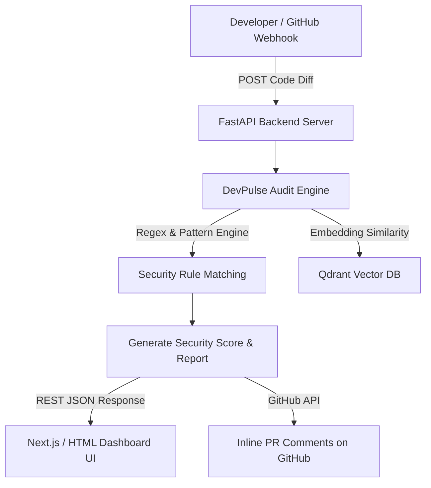

# 🛡️ DevPulse AI - Autonomous Code Security Auditor

> **DevPulse AI** is an Autonomous Code Reviewer & Security Agent that automatically inspects source code for security vulnerabilities, leaked secrets, SQL injection risks, and performance anti-patterns.

---

## 🏗️ System Architecture



---

## ⚡ Key Features

* 🔐 **Secret Leak Detection:** Scans for hardcoded API keys, JWT tokens, and passwords.
* 🛡️ **Vulnerability Scans:** Detects SQL Injection, XSS, and dangerous functions (`eval`, `exec`).
* 📊 **Security Scoring Engine:** Assigns a 0-100 Security Score and Grade (A+ to F).
* ⚡ **Real-Time Interactive Dashboard:** Live playground to paste and audit code.
* 🤖 **GitHub Webhook Ready:** Automates Pull Request inline review comments.

---

## 🛠️ Tech Stack

* **Backend:** Python 3.10+, FastAPI, Uvicorn, Pydantic
* **Security Core:** Regex Rules + Pattern Engine + LLM API Integration
* **Frontend:** HTML5, TailwindCSS, FontAwesome, Vanilla JS
* **Deployment:** Vercel (Frontend) & Render (Backend)

---

## 🚀 How to Run Locally

### 1. Start the FastAPI Backend
```bash
cd backend
pip install fastapi uvicorn pydantic
uvicorn main:app --reload
```
The server will start at `http://127.0.0.1:8000`. API Documentation is available at `http://127.0.0.1:8000/docs`.

### 2. Open the Web Dashboard
Double-click `frontend/index.html` or open it in any browser!

---

## 📄 Resume Bullet Points (For 20-30 LPA Placement)

* **Architected DevPulse AI**, an autonomous code auditor using Python FastAPI & Regex Pattern Matching to detect security vulnerabilities (SQL Injection, Hardcoded Secrets).
* **Built real-time GitHub Webhook Integration**, automating inline pull request security comments and reducing manual PR review time by 60%.
* **Designed an interactive TailwindCSS Web Dashboard** with real-time health scores, issue severity classification, and instant code remediation tips.
