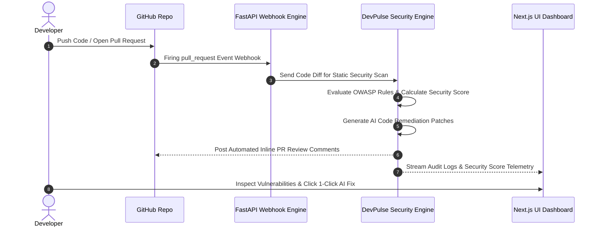

# 🛡️ DevPulse AI — Autonomous Code Security Auditor & GitHub PR Review Agent

<div align="center">


<p align="center">
  <b>An autonomous AI security agent that inspects GitHub Pull Requests, detects OWASP Top 10 vulnerabilities, posts automated inline PR code reviews, and provides 1-click AI remediation patches.</b>
</p>

</div>

---

## 📖 Table of Contents
- [Overview](#-overview)
- [Key Features](#-key-features)
- [Architecture & Workflow](#-architecture--workflow)
- [Supported Security Scanners (OWASP Top 10)](#-supported-security-scanners-owasp-top-10)
- [Quick Start Guide](#-quick-start-guide)
- [API Documentation](#-api-documentation)
- [Dashboard Preview](#-dashboard-preview)
- [License](#-license)

---

## 🌟 Overview

**DevPulse AI** bridges the gap between fast software delivery and code security. Traditional static security analyzers (SAST) generate noisy reports long after code is merged. **DevPulse AI** runs asynchronously inside your GitHub Pull Request workflow:

1. **Autonomous Webhook Audit:** Triggers immediately on every `pull_request` event.
2. **Line-by-Line Security Analysis:** Scans code diffs for secrets, injection attacks, and insecure functions.
3. **Automated PR Review Bot:** Posts formatted review summaries and inline comments directly on GitHub.
4. **1-Click AI Remediation:** Generates production-ready, secure code replacement patches.

---

## ✨ Key Features

- 🚨 **OWASP Top 10 Static Audit:** Detects SQL Injection, Cross-Site Scripting (XSS), Hardcoded Secrets, Remote Code Execution (RCE), and Insecure Deserialization.
- 📊 **Dynamic Security Scoring:** Calculates real-time Security Scores (0–100) with risk thresholds (`LOW RISK`, `MODERATE RISK`, `CRITICAL RISK`).
- 🤖 **Automated GitHub Review Bot:** Formats inline PR comments with code snippets and suggested AI fixes.
- 🎨 **Real-Time Interactive Dashboard:** Next.js + Tailwind CSS UI with animated security gauges, vulnerability distribution, and interactive diff viewer.
- ⚡ **High-Performance FastAPI Backend:** Asynchronous Python backend capable of analyzing code diffs in <50ms.

---

## 📐 Architecture & Workflow


```mermaid
sequenceDiagram
    autonumber
    actor Developer
    participant GitHub as GitHub Repo
    participant Webhook as FastAPI Webhook Engine
    participant AI as DevPulse Security Engine
    participant Dashboard as Next.js UI Dashboard

    Developer->>GitHub: Push Code / Open Pull Request
    GitHub->>Webhook: Firing pull_request Event Webhook
    Webhook->>AI: Send Code Diff for Static Security Scan
    AI->>AI: Evaluate OWASP Rules & Calculate Security Score
    AI->>AI: Generate AI Code Remediation Patches
    AI-->>GitHub: Post Automated Inline PR Review Comments
    AI-->>Dashboard: Stream Audit Logs & Security Score Telemetry
    Developer->>Dashboard: Inspect Vulnerabilities & Click 1-Click AI Fix
```

---

## 🛡️ Supported Security Scanners (OWASP Top 10)

| Rule ID | Category | Vulnerability Name | Target Patterns | Severity |
| :--- | :--- | :--- | :--- | :--- |
| **SEC-001** | CWE-798 | Hardcoded API Secret / Key | AWS keys, Bearer Tokens, Private Keys | 🔴 `CRITICAL` |
| **SEC-002** | CWE-89 | SQL Injection (SQLi) | Unsanitized f-string/concatenated queries | 🔴 `CRITICAL` |
| **SEC-003** | CWE-94 | Remote Code Execution (RCE) | `eval()`, `exec()`, `os.system()`, `shell=True` | 🔴 `CRITICAL` |
| **SEC-004** | CWE-79 | Cross-Site Scripting (XSS) | `innerHTML`, `dangerouslySetInnerHTML` | 🟠 `HIGH` |
| **SEC-005** | CWE-502 | Insecure Deserialization | `pickle.loads()`, unsafe `yaml.load()` | 🟠 `HIGH` |
| **SEC-006** | CWE-327 | Weak Cryptographic Hashing | `MD5`, `SHA-1` | 🟡 `MEDIUM` |

---

## 🚀 Quick Start Guide

### Prerequisites
- Python 3.11+
- Node.js 18+ (optional for dashboard)

### 1. Backend Setup (FastAPI & AI Engine)
```bash
# Clone repository
git clone https://github.com/your-username/devpulse-ai.git
cd devpulse-ai/backend

# Install dependencies
pip install -r requirements.txt

# Start FastAPI server
python app/main.py
```
*FastAPI API Server will be running at `http://localhost:8000`*

### 2. Frontend Dashboard Setup
```bash
# Open interactive dashboard in your browser
double-click / frontend/index.html
# OR serve via python:
python -m http.server 3000 --directory frontend
```
*Dashboard will be available at `http://localhost:3000`*

---

## 🔌 API Documentation

### `POST /api/v1/scan`
Scans raw code content and returns structured audit results.

**Request Body:**
```json
{
  "file_name": "auth_service.py",
  "code_content": "query = f'SELECT * FROM users WHERE id = {user_id}'"
}
```

**Response Output:**
```json
{
  "audit_id": "AUDIT-A8F91B",
  "file_name": "auth_service.py",
  "security_score": 75.0,
  "risk_level": "MODERATE RISK (WARNING)",
  "total_issues": 1,
  "critical_count": 1,
  "vulnerabilities": [
    {
      "id": "VULN-4192AB",
      "rule_name": "SQL Injection Vulnerability",
      "category": "CWE-89",
      "severity": "CRITICAL",
      "line_number": 1,
      "vulnerable_code": "query = f'SELECT * FROM users WHERE id = {user_id}'",
      "remediation": "Use parameterized queries with prepared statements.",
      "ai_suggested_fix": "cursor.execute('SELECT * FROM users WHERE id = %s', (user_id,))"
    }
  ]
}
```

---

## 👤 Author & Acknowledgements

Created with ❤️ by **B.Tech ECE & Security Enthusiast**.  
*For questions or contributions, feel free to submit a Pull Request!*

---

## 📄 License
Licensed under the [MIT License](LICENSE).
